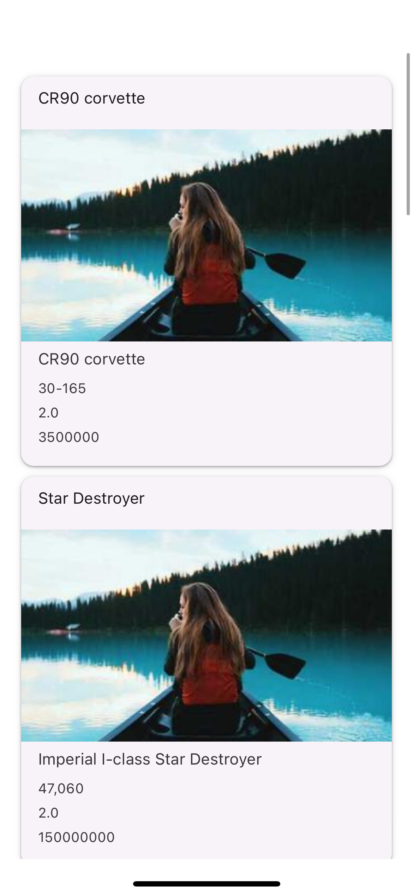

# Avancée 
## Foundation
- [x] 01
- [x] 02
- [x] 03
- [x] 04
- [x] 05

## Data Layer
- [x] 01
- [x] 02
- [x] 03

## Ecosystem
- [x] 01
- [x] 02
- [x] 03
- [x] 04
- [x] 05

## React Navigation
- [x] 01
- [~] 02
- [] 03
- [] 04

## Release
- [x] 01
- [x] 02
- [x] 03
- [~] 04 (j'ai mis sur Vercel mais j'ai une erreur)

# Tuto
- npm install
- npm start

# Screens

